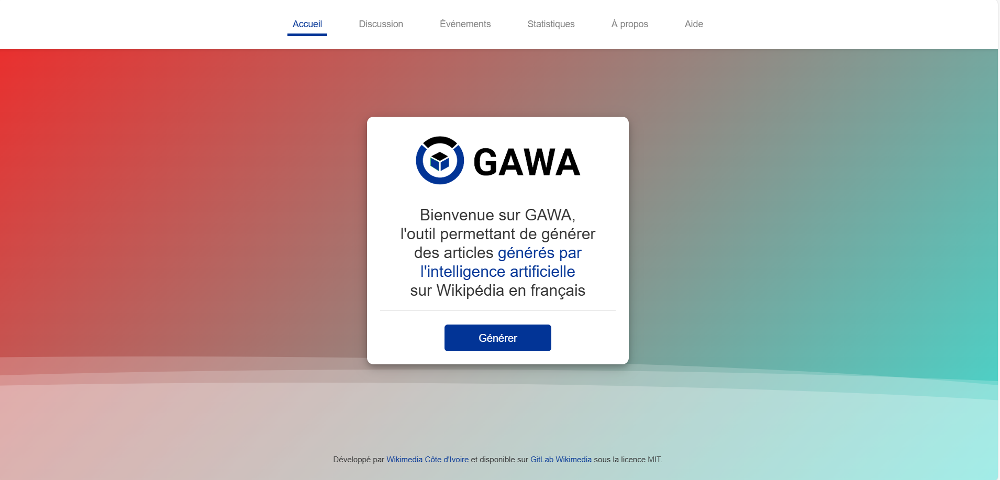

# GAWA (un outil de Wikimedia Côte d'Ivoire)



GAWA (signifiant Générateur d'Articles Wikipedia à Améliorer) est outil développé et géré par l'équipe de développeurs de la communauté [Wikimedia Côte d'Ivoire](https://wikimedia.ci/).
GAWA est un outil de détection et de génération d’article wikipédia à améliorer de [Wikimedia Côte d'Ivoire](https://wikimedia.ci/). Ce logiciel se focalise actuellement sur les contenus éducatifs ivoiriens de l’encyclopédie libre en ligne [Wikipédia](https://fr.wikipedia.org/wiki/Wikip%C3%A9dia:Accueil_principal). Pour en savoir plus : [cliquez ici](https://meta.wikimedia.org/wiki/Wikimedia_C%C3%B4te_d%27Ivoire/GAWA)

Pour déployer et tester l'outil GAWA en local (sur votre ordinateur), veuillez suivre les étapes suivantes :

## Déployer et tester l'outil GAWA en local

### 1. Préparer l'environnement local

1. Installer [Python 3.x](https://www.python.org/downloads/) (si ce n'est pas déjà fait).
2. Installer le framework [Flask](https://flask.palletsprojects.com/en/latest/) via pip avec la commande suivante :
    ```bash
    $ pip install Flask
    ```

### 2. Cloner le projet

Clonez le projet à partir du dépôt GitHub :
```bash
$ git clone https://gitlab.wikimedia.org/toolforge-repos/gawa.git
```

## Licence

Le projet est open source et disponible sous la [Licence MIT](LICENSE).


